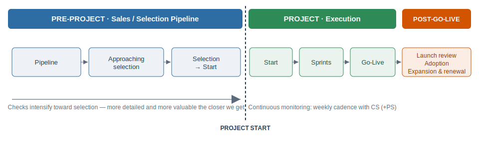
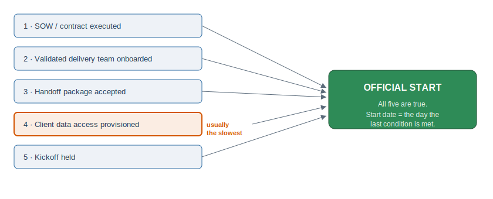
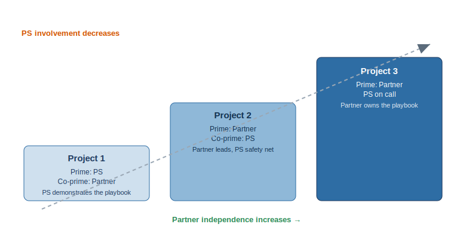
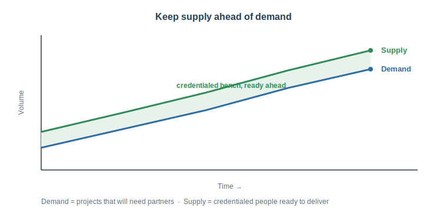
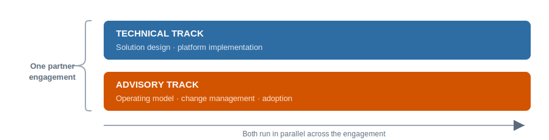

---
---

# 03 · Delivery Excellence — Deep Dive

> Delivery excellence starts in the sales cycle, not at project kickoff. The work that sets a
> project up to succeed happens before the build begins. We get the things that matter right early
> — partners who are ready, scope that's accurate, handoffs that carry full context — so delivery
> runs smoothly from day one.
>
> Every deployment starts fully prepared.

> How this doc is organized: each area below has the same shape — Overview, Methods, Measures — so
> any area can be expanded on its own. Overviews are a single paragraph. Indented note callouts
> (like this one) hold commentary, justification, or side thoughts rather than part of the plan
> itself. This is a working document and is expected to grow. Sections marked `[ to expand ]` are
> placeholders.

---

## Objective

Every implementation is delivered by a partner who is prepared, current, and properly staffed for
the specific application and client. We get there by moving partner readiness and scoping work
earlier, into the sales process.

**Seeing both sides — demand and supply.** Doing this well means watching two things at once:

- **Demand — the work that's coming.** How many projects are heading our way that will need a
  partner to deliver them, and when.
- **Supply — the people ready to do it.** Whether our partners have enough trained, available
  people to deliver that work well.

We watch both so we always have enough trained partner people lined up ahead of the work, ready
when a project lands.

---

## The Delivery Excellence Spectrum

Delivery excellence runs along one timeline, from early in the sales cycle through go-live and
beyond. Project Start is the dividing line: before it, we work through a series of readiness
checks; after it, we monitor delivery week to week.

The closer a deal gets to partner selection, the more detailed and valuable these checks become.
Early in the pipeline the touch is light; approaching selection there's a readiness gate; from
selection to start we validate the team and run the handoff; after start we monitor delivery
sprint by sprint.

| # | Area | Phase | Summary |
|---|---|---|---|
| 1 | [Front-load into sales](#1-front-load-into-sales--assume-selected) | Pre-project | Engage the likely partner early, "assume selected" |
| 2 | [Readiness gate (Stage 3→4)](#2-readiness-gate--sales-stage-3--stage-4) | Pre-project (approaching selection) | Gate: enablement + current app + named key roles |
| 3 | [Scoping accuracy](#3-scoping-accuracy--the-deliverable-of-this-phase) | Pre-project (around selection) | OOTB understanding, design, data mapping, extensions |
| 4 | [Team validation](#4-team-validation--partner-and-individual-level) | Selection → Start | Partner and individual; roster shared in waves |
| 5 | [Pre-sales → delivery handoff](#5-pre-sales--delivery-handoff) | Selection → Start | A defined artifact package, not a conversation |
| 6 | [Project Start](#6-project-start--definition--trigger) | The dividing line | When has the project officially started? |
| 7 | [Execution → Go-Live](#7-execution--go-live) | Project (execution) | Weekly cadence with CS (+PS); sprints to go-live |
| 8 | [Post-Go-Live → Expansion](#8-post-go-live--expansion) | Post-go-live | Launch review, training, adoption, expansion |
| 9 | [Prime/co-prime ladder](#9-prime--co-prime-ladder) | Cross-project | Teaching the playbook across three projects |
| 10 | [Partner capacity & coverage](#10-partner-capacity--resource-coverage-supply--demand) | Portfolio | Monitor supply and demand; no last-minute staffing |
| 11 | [Advisory & change management](#11-advisory--change-management--a-parallel-service-line) | Parallel — all phases | A distinct service line beyond technical implementation |

---

## 1. Front-load into sales — "assume selected"

### Overview
We engage the likely implementation partner early, before the deal is won, and bring them into
scoping while we're still selling, so the scope is accurate by the time delivery starts.

> When a partner sources a deal, we assume they will implement it — but being selected to implement
> is not the same as being selected to lead. Their role (prime or co-prime) comes from their ladder
> stage for that application (see §9).
>
> On a partner's first project this creates tension: they sourced the deal, but PS leads as prime
> while they deliver as co-prime. PS leads the first one so the partner learns the playbook properly,
> then leads it themselves on later projects. The partner stays on the deal and earns throughout.

### Methods
- Identify the likely implementation partner early in the sales cycle.
- Treat partner sourcing as the trigger to assume that partner is selected to implement.
- Engage them under an "assume selected" posture.
- Set the partner's role (prime or co-prime) from their ladder stage, not from who sourced the deal.
- _[ to expand ]_

### Measures
- _[ to expand ]_

---

## 2. Readiness gate — Sales Stage 3 → Stage 4

### Overview
To progress an opportunity to Sales Stage 4, the selected or originating partner first completes the
assigned Connected Enablement journey for the application, holds the current application version in
their tenant, and has its named key roles credential-checked.

> Readiness at this gate is confirmed, not assumed.

### Methods
- The Connected Enablement journey for the specific application is assigned early and completed
  before the opportunity moves to Stage 4.
- The current application version is present in the partner tenant, and we have visibility into both
  the apps they're proposing and what's actually in their tenant.
- Named key roles, especially the Solution Architect, are identified and credential-checked at the gate.
- _[ to expand ]_

### Measures
- Connected Enablement journey complete before Stage 4 (date-stamped at the gate).
- Partner tenant holds the current app version at proposal (confirmed through tenant visibility).
- Named key roles credentialed at the gate.
- _[ to expand ]_

---

## 3. Scoping accuracy — the deliverable of this phase

### Overview
This phase produces the scope, built on the Anaplan Way for Applications methodology, so we start
from what the application already does rather than a blank sheet.

> Getting scope right here is what makes the build predictable: when scope matches expectations,
> extensions are planned for, and data mapping is correct, delivery runs smoothly.

### Methods
- Partner demonstrates a complete understanding of what the application ships out of the box (OOTB).
- The right design is in place.
- Client data is identified and mapped to the application (schema mapping).
- Extensions are identified and prioritized — the difference between what ships OOTB and what this
  client needs.
- _[ to expand ]_

### Measures
- _[ to expand ]_

---

## 4. Team validation — partner and individual level

### Overview
We credential partner resources per application through completed application blueprints. We want to
track it so the specific resources staffed on a project are the ones who completed the application
blueprint.

### Methods
- Track completion of application blueprints at the individual level — completing the blueprint is
  how an individual is credentialed on an application.
- Confirm the individuals who completed the blueprints are the ones actively assigned to the
  project, not just available on the partner's bench.
- Roster shared in waves, since the full team often isn't assembled until just before kickoff:
  - Wave 1 (at or near the gate): early-arriving key roles, especially the Solution Architect.
  - Wave 2 (by kickoff): the full roster, validated at the individual level before build starts.
- Validate credentials and experience against the per-application model at both levels.
- _[ to expand ]_

### Measures
- Application blueprints completed at the individual level for the named delivery team.
- Share of project-assigned individuals whose completed blueprints match the application they are
  staffed on (the people who did the blueprints are the people on the project).
- _[ to expand ]_

---

## 5. Pre-sales → delivery handoff

### Overview
A handoff works best as a defined package of artifacts. This is how the scoping work done during
the sale carries cleanly into delivery.

### Methods
- Deliver a defined handoff package:
  - Scope, including the difference between OOTB and extensions
  - Prioritized extensions
  - The agreed design
  - Client data schemas mapped to the application — the most important artifact in the package
- Give the team access to all content (app, design, data schemas, enablement) on day one.
- Prefer Solution Architect continuity — the SA who scoped the deal in pre-sales carries it into
  delivery.
- _[ to expand ]_

### Measures
- Handoff package complete at kickoff (checklist: scope, design, data schemas mapped, prioritized
  extensions).
- _[ to expand ]_

---

## 6. Project Start — definition & trigger

### Overview
Project Start divides the readiness phase from the delivery phase. We define it by whether the team
can actually do productive work, not just by whether the SOW is signed. The aim is a start point
where the team is genuinely ready to begin, so we treat start as a set of conditions that all have
to be true, and the start date is the day the last one is met.

### Methods — conditions for an official start
The project has officially started when all of these are true:
1. SOW / contract executed
2. Validated delivery team onboarded (individual-level credentials confirmed)
3. Handoff package received and accepted by the delivery team
4. Client data access granted and provisioned (usually the slowest one)
5. Kickoff held

> Data access is often the biggest source of delay before sprints can begin. Track it on its own,
> not folded into "kickoff."

### Measures
- Official start date — the day the last condition is met.
- Selection-to-start cycle time (and SOW-to-start).
- Time to data access — days from selection or SOW to client data access granted.
- _[ to expand ]_

---

## 7. Execution → Go-Live

### Overview
Once the project starts, the work shifts from checking readiness to watching delivery. Customer
Success, with Professional Services when needed, meets with the partner weekly to catch progress
problems and concerns early. The partner delivers in sprints through to go-live.

### Methods
- Weekly cadence with Customer Success (and PS as needed) to review progress and risks.
- Surface progress and any concerns early, while there's time to act.
- Resolve data access as the first blocker if it's still open from Project Start.
- Partner delivers in sprints through to go-live.
- _[ to expand — sprint checkpoints, escalation path, go-live readiness criteria ]_

### Measures
- Weekly cadence held on time.
- Lead time on risk detection — issues surfaced early vs. late.
- Sprint progress vs. plan.
- _[ to expand ]_

---

## 8. Post-Go-Live → Expansion

### Overview
After go-live we run a launch review, hand over documentation, deliver training, and drive adoption,
setting the deployment up to renew and expand.

> This is where the work hands back to pipeline (Pillar 01) and win rate (Pillar 02): the launch
> review feeds lessons into the next project, and adoption is what makes the deployment worth renewing.

### Methods
- Launch review / post-mortem — what went right and wrong; feed the lessons into the next project
  as teaching material.
- Partner-produced handover documentation, so the deployment is sustainable after the partner steps
  back:
  - Operational documentation (how to run and maintain the solution day to day)
  - Technical documentation (model and architecture, data flows, extensions, integrations)
  - Training plans for the client team
  - Onboarding materials for new client users
- Deliver the training to the client team.
- Drive adoption so the delivered capability actually gets used.
- Set up expansion and renewal off the back of the value delivered.
- _[ to expand ]_

### Measures
- Post-mortem completed and lessons logged.
- Handover documentation complete and accepted (same checklist approach as the pre-sales handoff).
- Adoption signals (usage, active users — defined objectively).
- Expansion pipeline and renewal sourced from the deployment.
- _[ to expand ]_

---

## 9. Prime / co-prime ladder

### Overview
The ladder is how we teach the partner the whole playbook, not just supervision that tapers off.
Over three projects the partner learns by doing the work while PS involvement decreases, and on the
first project PS shows them the artifacts directly — the content they need, the reviews that have to
happen, the project checklists, the cadences — until a competent partner is one who has run the full
playbook start to finish on their own.

> We track this per application, at both the partner and individual level. It also reduces PS effort
> per partner over time, which frees PSMs to work at a more strategic level.

| Project | Prime | Co-Prime | What it teaches |
|---|---|---|---|
| 1st | PS | Partner | PS demonstrates the artifacts; partner observes and assists |
| 2nd | Partner | PS | Partner runs the playbook with PS as safety net and reviewer |
| 3rd | Partner | PS on call | Partner owns the full playbook; PS available, not embedded |

### Methods — what gets transferred
- The content the partner needs for each phase.
- The reviews that have to happen (design reviews, gate reviews, go-live readiness).
- The project checklists for each phase and sprint.
- The cadences (the weekly CS/PS rhythm, sprint ceremonies).
- _[ to expand — map each artifact to the phase it belongs to ]_

### Measures
- Current ladder stage per partner, per application (and eventually per individual).
- Playbook artifacts the partner can demonstrably run on their own.
- _[ to expand ]_

---

## 10. Partner capacity & resource coverage (Supply ↔ Demand)

### Overview
Delivery excellence means managing both sides of partner resourcing, not just demand. Demand is the
deals that will need partners. Supply is the credentialed people available to deliver them. We want
credentialed people ready ahead of demand, so teams are drawn from a prepared bench rather than
assembled at the last minute. We track both across the portfolio.

### Methods
- Demand-side monitoring — forecasted projects that will need partner delivery, per application,
  with timing (ties to the Pillar 01 pipeline and coverage ratio).
- Supply-side monitoring — credentialed partner people available per application, at partner and
  individual level, including bench depth, utilization, and availability.
- Capacity planning — match supply to forecasted demand ahead of time, and flag applications where
  supply won't meet demand before it becomes a bottleneck at the gate.
- Staff from a prepared bench — draw teams from an existing credentialed bench, so credentialing is
  already done before a deal lands.
- _[ to expand ]_

### Measures
- Coverage ratio per application — credentialed supply vs. forecasted demand.
- Bench depth — number of credentialed individuals per application (partner and individual).
- Bench-based staffing — share of projects staffed from the existing credentialed bench, and the
  lead time between team assembly and project start.
- Utilization of credentialed people.
- _[ to expand ]_

---

## 11. Advisory & Change Management — a parallel service line

### Overview
Beyond technical design and platform implementation, partners deliver advisory and
change-management services: helping the client shape the operating model, prepare the organization,
and adopt new ways of working. We treat this as its own service line, credentialed and resourced in
its own right, not as an add-on to the build.

> Advisory runs in parallel with the technical track, not as a phase of it. A partner can be strong
> technically and still need advisory capability, or the reverse, so we track and credential the two
> separately.

### Methods
- Operating-model and process advisory — help the client design how they will plan and work, not
  just configure the application.
- Change management — stakeholder alignment, communications, and preparing client users for new
  ways of working.
- Adoption planning — drive usage and value realization (connects to §8 Post-Go-Live).
- Credential advisory capability as its own track, separate from technical credentials.
- Name advisory and change-management roles distinctly in the team roster (see §4).
- _[ to expand ]_

### Measures
- Advisory and change-management capability credentialed at the partner and individual level.
- Share of engagements with a named advisory / change-management role on the team.
- Adoption and value-realization outcomes (connects to §8).
- _[ to expand ]_

---

## Opportunities to Strengthen
Areas to build out next, kept in a companion doc:
[delivery-excellence-gaps-and-risks.md](delivery-excellence-gaps-and-risks.html)
