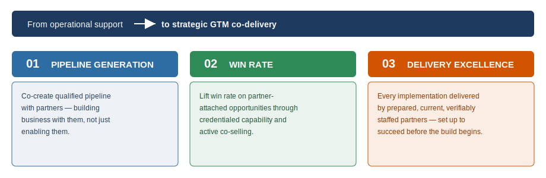

---
---

# The Evolved Partner Success Role
**Objectives, Methods & Measures**

> **From operational support → to strategic GTM co-delivery.**
> PSMs partner on how to combine partner strengths with Anaplan capability to drive measurable outcomes.

---

## 01 · Pipeline Generation

**Objective**
Actively co-create qualified pipeline with partners — moving from enabling partners to building business *with* them.

**Methods · The Playbook**
- Joint GTM co-delivery planning per strategic partner
- Map partner industry & domain strengths to Anaplan whitespace
- Co-build repeatable solution plays & offers
- Quarterly partner business reviews anchored on sourced pipeline

**Measures · How We Track Success**
- Partner-sourced & influenced pipeline ($)
- \# active joint GTM co-delivery initiatives
- \# co-built solution plays in-market
- Partner pipeline coverage ratio vs target

---

## 02 · Win Rate

**Objective**
Lift win rate on partner-attached opportunities through credentialed capability and active co-selling.

**Methods · The Playbook**
- Deploy journey-credentialed specialists into live deals
- Structured pre-sales & co-selling motions with partners
- Competitive positioning & solution-fit support
- Match partner expertise to opportunity at qualification

**Measures · How We Track Success**
- Win rate: partner-attached vs non-attached
- % deals with credentialed partner specialist
- Deal-size uplift on co-sold opportunities
- Reduction in time-to-close

---

## 03 · Delivery Excellence

**Objective**
Ensure every implementation is delivered by verifiably competent partners, driving toward zero troubled deployments.

**Methods · The Playbook**
- Credentialed journeys mandatory before delivery
- Proactive deployment health checks & checkpoints
- Expert / masterclass tier for complex engagements
- Continuous capability uplift via Connected Enablement

**Measures · How We Track Success**
- Troubled deployments (target: zero)
- % implementations by credentialed partners
- Deployment health & customer CSAT score
- Time-to-value at go-live

---

> **Enabled by Connected Enablement.**
> Composable journeys scale capability — freeing PSMs to operate at a strategic level. → Toward enterprise-wide Connected Planning.
